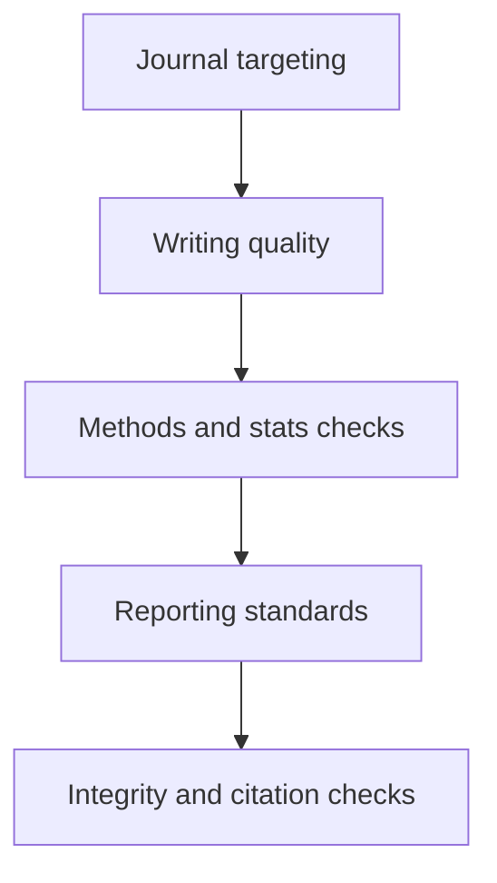

# Quality Stack Map Diagram

```mermaid
flowchart TD
  A[Journal targeting] --> B[Writing quality]
  B --> C[Methods and stats checks]
  C --> D[Reporting standards]
  D --> E[Integrity and citation checks]
```
